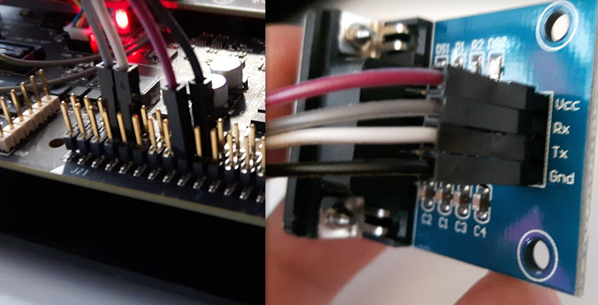

# KVH GPS Driver

## Overview

This is a C++ serial ROS driver for KVH Geo-Fog dual GPS / GNSS Receivers. This code is based on the officilal C driver provided by KVH.

*Important note*: we do not own the GPS anymore, this a legacy code, but for someone it may be useful. If so, please fork the repo and maintain the code.


## Usage 

After cloning to catkin workspace, just build the GPS packages in the workspace:
```bash
catkin build
```

Source setup.bash (optionally add it to your .bashrc file):
```bash
source devel/setup.bash
```

Run the GPS publisher node or the dummy node (which is just random GPS data for testing):
```bash
rosrun gps_kvh gps_kvh_node
rosrun gps_kvh gps_kvh_node /dev/ttyS0 115200
rosrun gps_kvh gps_kvh_dummy_node
```

The following rostopic will be published:
```
/gps/fix
/gps/kvhstatus
/gps/status
/gps/utmzone
/odom
```

The rostopic `/odom` contains e.g. the following:
```c
header: 
  seq: 10957
  stamp: 
    secs: 1545048568
    nsecs: 161516056
  frame_id: "odom"
child_frame_id: ''
pose: 
  pose: 
    position: 
      x: 5283563.77831
      y: 696058.293832
      z: 157.0
    orientation: 
      x: 0.862203
      y: 0.006738
      z: -0.5065
      w: -0.00356
  covariance: [0.0, 0.0, 0.0, 0.0, 0.0, 0.0, 0.0, 0.0, 0.0, 0.0, 0.0, 0.0, 0.0, 0.0, 0.0, 0.0, 0.0, 0.0, 0.0, 0.0, 0.0, 0.0, 0.0, 0.0, 0.0, 0.0, 0.0, 0.0, 0.0, 0.0, 0.0, 0.0, 0.0, 0.0, 0.0, 0.0]
twist: 
  twist: 
    linear: 
      x: 0.0
      y: 0.0
      z: 0.0
    angular: 
      x: 0.0
      y: 0.0
      z: 0.0
  covariance: [0.0, 0.0, 0.0, 0.0, 0.0, 0.0, 0.0, 0.0, 0.0, 0.0, 0.0, 0.0, 0.0, 0.0, 0.0, 0.0, 0.0, 0.0, 0.0, 0.0, 0.0, 0.0, 0.0, 0.0, 0.0, 0.0, 0.0, 0.0, 0.0, 0.0, 0.0, 0.0, 0.0, 0.0, 0.0, 0.0]
```

The rostopic `/gps/fix` contains e.g. the following:
```c
header: 
  seq: 11062
  stamp: 
    secs: 1545054463
    nsecs: 259962916
  frame_id: ''
status: 
  status: 0
  service: 0
latitude: 47.694527854
longitude: 17.628158172
altitude: 0.0
position_covariance: [0.0, 0.0, 0.0, 0.0, 0.0, 0.0, 0.0, 0.0, 0.0]
position_covariance_type: 0
```

## Testing the serial connection

### Connect the pins:



### On the PC side with HL-340:
`lsusb` 
 - you should see the following:
 - `Bus 002 Device 004: ID 1a86:7523 QinHeng Electronics HL-340 USB-Serial adapter`
```c
ls /dev/ttyUSB*
ls -l /dev/ttyU*
sudo chmod 777 /dev/ttyUSB0
```

On Ubuntu, the simplest way to resolve the permissions problem, is to add yourself to the 'dialout' user group.
```
$ ls -l /dev/ttyU*
crw-rw---- 1 root dialout 188, 0 Jun 12 13:28 /dev/ttyUSB0
$ sudo adduser yourusername dialout
```
For the group change to take effect the first time, you need to log out and back in again.

```
sudo minicom
```


### On Jetson:
```c
sudo chmod 777 /dev/ttyUSB0
sudo chmod 777 /dev/ttyS0
sudo minicom
```

## More info
- https://www.kvh.com/Military-and-Government/Gyros-and-Inertial-Systems-and-Compasses/Gyros-and-IMUs-and-INS/INS/GEO-FOG-3D-DUAL.aspx
- http://www.advancednavigation.com/product/spatial-fog-dual
